# WELL Come to Django Journey
- 1️⃣ Django is a high-level Python web framework 
- 2️⃣ It encourages rapid development and clean, pragmatic design.
- 3️⃣ Built by experienced developers, it takes care of much of the hassle(like database management, user authentication, and URL routing) so you can focus on writing your app without needing to reinvent the wheel.
- 4️⃣ Django is free and open source, has a thriving and active community, great documentation, and many options for free and paid-for support.
- 5️⃣ Django makes it easier to build better web apps more quickly and with less code
- 6️⃣ It follows the "batteries-included" philosophy and comes with a wide range of built-in features, such as an admin interface, ORM (Object-Relational Mapping), and form handling.
- 7️⃣ Django is designed to be scalable and secure, making it a popular choice for building web applications of all sizes, from small personal projects to large-scale enterprise applications.
- 8️⃣ It follows the Model-View-Template (MVT) architectural pattern, which helps to separate the different components of a web application and makes it easier to maintain and scale.
- 9️⃣ Django is used by many well-known companies and organizations, including Instagram, Pinterest, and the Washington Post.
- 🔟 Overall, Django is a powerful and flexible web framework that can help you build high quality web applications quickly and efficiently.

<hr>
<h1 align="center">Think real-life Example </h1>
<hr>

- Imagine you want to build a Hosuse 🏠. 
- You could try to gather all the raw materials (bricks, wood, nails, etc.) and build it from scratch, but that would take a lot of time and effort.(like building a web application from scratch) like flask and fastapi.

<br>

- Instead, you could use a pre-fabricated house kit that comes with all the necessary materials and instructions for assembly.
- This is similar to how Django works. 

-  👇⬇️⤵️

- HTML/CSS/JS = bricks, paint, windows (frontend)
- Flask/FastAPI = you have to lay every brick yourself (lightweight but tiring)
- Django = a luxury pre-built house with electricity, plumbing, security system, doors, and even a built-in alarm — you just decorate and add rooms 


### PART 1: Foundations & First Project (Ground Level)

#### 1. What is Django Really? (Deep Understanding)

Think of building a house:

- HTML/CSS/JS = bricks, paint, windows (frontend)
- Flask/FastAPI = you have to lay every brick yourself (lightweight but tiring)
- Django = a luxury pre-built house with electricity, plumbing, security system, doors, and even a built-in alarm — you just decorate and add rooms.

Django is a "batteries-included" web framework written in Python. It follows the MTV pattern:


**MTV = Model - Template - View** (Django's version of MVC)

- Model → Database layer (your data)
- Template → What the user sees (HTML)
- View → The brain (Python code that connects everything)

Real-life proof: Instagram (300M+ users), Spotify, YouTube (some parts), NASA, The Onion — all run on Django.

#### 2. Prerequisites (You Need These)

You must be comfortable with:
- Python basics (variables, functions, classes, lists/dicts)
- Basic command line (cd, ls/dir, pip)
- Very basic HTML (we'll teach as we go)


# Django Request-Response Flow: Beautiful Mermaid Diagram

Here's a visually appealing Mermaid diagram that illustrates the complete Django request-response flow with emojis, colors, and icons:

```mermaid
flowchart TD
    %% Styling definitions
    classDef browser fill:#e1f5fe,stroke:#01579b,stroke-width:2px,color:#01579b
    classDef server fill:#f3e5f5,stroke:#4a148c,stroke-width:2px,color:#4a148c
    classDef component fill:#e8f5e8,stroke:#1b5e20,stroke-width:2px,color:#1b5e20
    classDef data fill:#fff3e0,stroke:#e65100,stroke-width:2px,color:#e65100
    classDef response fill:#fce4ec,stroke:#880e4f,stroke-width:2px,color:#880e4f
    
    %% Browser Section
    A[🖥️ Browser<br/>User Interface]:::browser
    
    %% Request
    A -->|“1. 📨 HTTP Request<br/>GET /products/5/”| B
    
    %% Django Server Container
    subgraph B[🖥️ Django Server]
        direction TB
        C[“🌐 URL Router<br/>urls.py”]:::component
        D[“⚙️ View<br/>views.py”]:::component
        E[“💾 Model<br/>Database”]:::data
        F[“📄 Template<br/>HTML Files”]:::data
        
        C -->|“2. 🔍 Match URL Pattern<br/>Find right view”| D
        D -->|“3. 🛠️ Process Request<br/>Business Logic”| E
        D -->|“4. 🎨 Get Template”| F
        E -->|“📊 Fetch Data”| D
        F -->|“✨ Render with Data”| D
    end
    
    %% Response
    B -->|“5. 📤 HTTP Response<br/>Rendered HTML Page”| G
    
    %% Final Display
    G[“🖥️ Browser<br/>📱 Shows Final Page<br/>User sees content”]:::response

    %% Styling for the server box
    class B server
```



<hr>
<h1 align="center">See Here Big Picture of Django Request-Response Cycle</h1 >
<hr>


#### 3. Installation — The Correct & Professional Way (2025 Best Practices)

Open your terminal (or PowerShell/Anaconda Prompt) and follow exactly:

```bash
# 1. Create a folder for all your Django projects
mkdir django-journey
cd django-journey

# 2. Create a virtual environment (isolated Python environment - MUST do this!)
python -m venv venv

# 3. Activate it
# Windows:
venv\Scripts\activate
# Mac/Linux:
source venv/bin/activate

# You should now see (venv) in your terminal

# 4. Upgrade pip
pip install --upgrade pip

# 5. Install Django (latest stable as of Nov 2025 → Django 5.1+)
pip install django

# 6. Verify installation
python -m django --version
# → Should show 5.1.x or higher
```

Done. You now have a professional setup.

#### 4. Your First Django Project — "TaskFlow"

```bash
# Still in the django-journey folder with (venv) active
django-admin startproject taskflow_project

cd taskflow_project

# See the structure
tree /f   # Windows
# or
tree      # Mac/Linux
```

Project structure (beautifully explained):

```text
taskflow_project/          ← Outer folder (just a container)
├── taskflow_project/      ← Real Python package (settings live here)
│   ├── __init__.py
│   ├── settings.py        ← The heart of your app (database, security, apps, etc.)
│   ├── urls.py            ← Main URL router
│   ├── asgi.py            ← For async (we'll use later)
│   └── wsgi.py            ← Production server entry point
└── manage.py                  ← Command-line utility (your best friend)
```

Mermaid diagram of project structure:


#### 5. Run Your First Server — See the Magic

```bash
python manage.py runserver
```

Open browser → http://127.0.0.1:8000

You will see Django's beautiful welcome page with a rocket ship 🚀

Proof you're a real web developer now.

This page is served by Django itself — no HTML file written yet!


<hr>
<h1 align="center">Congratulations! 🎉</h1 >
<h3 align="center">You have successfully set up Django and created your first project!</h3>
<hr>