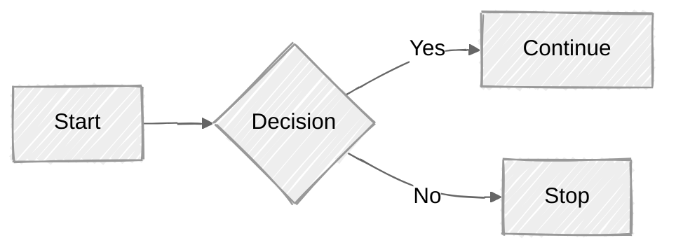

# models i django is hart of any django application. models are used to define the structure of the database tables and the relationships between them. in django, models are defined as python classes that inherit from django.db.models.model.


## creating a model
to create a model in django, you need to define a class that inherits from django.db.models.model. each attribute of the class represents a field in the database table. here is an example of a simple model:

```python
from django.db import models
class Person(models.Model):
    first_name = models.CharField(max_length=30)
    last_name = models.CharField(max_length=30)
    age = models.IntegerField()
    email = models.EmailField()
    
    def __str__(self):
        return f"{self.first_name} {self.last_name}"
``` 

# Explanation

- `first_name`, `last_name`: these are character fields that can store up to 30 characters.
- `age`: this is an integer field that stores the age of the person.

`` EAMAIL ``: this is an email field that stores the email address of the person.





