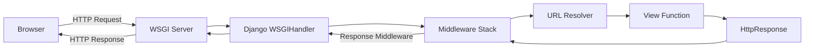

# 🚀 Project Overview

Welcome to the **Awesome Project**!

This document covers:

1. Features
2. Code Examples
3. Architecture Diagrams
4. Screenshots

---

## 🧩 Features

- Cross-platform
- Fast and modular
- Easy to extend

---

## 💻 Code Example

Here’s a simple example in Python:

```python
def greet(name):
    return f"Hello, {name}!"
```

<hr>
## 📊 Architecture Diagram




-  ## 🖼️ Back-End Development
# Outline of Contents
<details>
<summary><b>Day 01 — Basics Setup ⚙️</b></summary>

| Subtopic | Link |
|-----------|------|
| Command Line | [Click Here](./Concepts/day01_sub1.md) |
| Installation | [Click Here](./Concepts/day01_sub2.md) |
| Syntax | [Click Here](./Concepts/day01_sub3.md) |

</details>

<details>
<summary><b>Day 02 — Variables & Built-in Functions 🧩</b></summary>

| Subtopic | Link |
|-----------|------|
| Numbers & Strings | [Open](./02_Day_Variables_builtin_functions/sub1.md) |
| Type Casting | [Open](./02_Day_Variables_builtin_functions/sub2.md) |

</details>


    