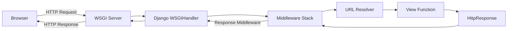

# 🚀 Project Overview

Welcome to the **Awesome Project**!

This document covers:

1. Features
2. Code Examples
3. Architecture Diagrams
4. Screenshots

---

## 🧩 Features

- Cross-platform
- Fast and modular
- Easy to extend

---

## 💻 Code Example

Here’s a simple example in Python:

```python
def greet(name):
    return f"Hello, {name}!"
```

<hr>
## 📊 Architecture Diagram



<h1 style="text-align: center; color: aqua;"> 🖼️ Back-End Development </h1>
<h3 style="text-align:center;color:green;">Content That we learn in Detailed</h3> 


<h2 align="center">🌐 Networking Study Journey</h2>
<p align="center">Click a day below to open its detailed lessons 🚀</p>

---

| Day | Topic                       | Progress | Open                   |
|-----|-----------------------------|-----------|------------------------|
| 🌐 Day 01 | Internet Basics_to_advance  | ✅ Done | [Open →](internet/day01.md)             |
| 📡 Day 02 | Networking Devices          | 🚧 In Progress | [Open →](./Days/Day02.md) |
| 🛰️ Day 03 | Protocols                   | ⏳ Pending | [Open →](./Days/Day03.md) |
| 🌍 Day 04 | IP Addressing               | ⏳ Pending | [Open →](./Days/Day04.md) |
| 🔐 Day 05 | Network Security            | ⏳ Pending | [Open →](./Days/Day05.md) |

---

📘 **How to use:**
- Click on a **Day** to open its detailed topics.  
- Inside each day, use the **Read**, **Try**, or **Resources** buttons to dive deeper.

---

