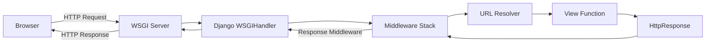

# 🚀 Project Overview

Welcome to the **Awesome Project**!

This document covers:

1. Features
2. Code Examples
3. Architecture Diagrams
4. Screenshots

---

## 🧩 Features

- Cross-platform
- Fast and modular
- Easy to extend

---

## 💻 Code Example

Here’s a simple example in Python:

```python
def greet(name):
    return f"Hello, {name}!"
```

<hr>
## 📊 Architecture Diagram



<h1 style="text-align: center; color: aqua;"> 🖼️ Back-End Development </h1>
<h3 style="text-align:center;color:green;">Content That we learn in Detailed</h3> 

<div align="center">

<details>
<summary><b>🌐 Day 01 — Internet</b></summary>

<br>

<table>
<tr>
<th>📘 Subtopic</th>
<th>🧠 Deep Theory</th>
<th>🧪 Lab / Experiment</th>
<th>📚 More Resources</th>
<th>🔖 Status</th>
</tr>

<tr>
<td>What is Network?</td>
<td><a href="./Concepts/day01_sub1.md">Read</a></td>
<td><a href="./Labs/day01_lab1.md">Try</a></td>
<td><a href="https://www.geeksforgeeks.org/computer-network-tutorials/">Link</a></td>
<td>✅ Done</td>
</tr>

<tr>
<td>History of Network</td>
<td><a href="./Concepts/day01_sub2.md">Read</a></td>
<td><a href="./Labs/day01_lab2.md">Try</a></td>
<td><a href="https://internet-history.fandom.com/wiki/Internet_History">Link</a></td>
<td>🚧 In Progress</td>
</tr>

<tr>
<td>What is Internet?</td>
<td><a href="./Concepts/day01_sub3.md">Read</a></td>
<td><a href="./Labs/day01_lab3.md">Try</a></td>
<td><a href="https://www.cloudflare.com/learning/network-layer/what-is-the-internet/">Link</a></td>
<td>⏳ Pending</td>
</tr>
</table>

<br>

🧭 <i>Dive into how the Internet evolved — from basic networks to the modern web we rely on today.</i>

</details>
</div>


<h2 align="center">📚 Networking Study Journey</h2>
<p align="center">Track your progress day by day — theory, labs, and resources 🚀</p>

---

### 🗓️ Course Progress Overview
| Day | Topic | Status |
|-----|--------|--------|
| 🌐 Day 01 | [Internet](#day-01--internet) | ✅ Done |
| 📡 Day 02 | [Networking Devices](#day-02--networking-devices) | 🚧 In Progress |
| 🛰️ Day 03 | [Protocols](#day-03--protocols) | ⏳ Pending |
| 🌍 Day 04 | [IP Addressing](#day-04--ip-addressing) | ⏳ Pending |
| 🔐 Day 05 | [Network Security](#day-05--network-security) | ⏳ Pending |

---

<div align="center">

<!-- ========== DAY 01 ========== -->
<details id="day-01--internet">
<summary><b>🌐 Day 01 — Internet</b></summary>

<br>

<table>
<tr>
<th>📘 Subtopic</th>
<th>🧠 Deep Theory</th>
<th>🧪 Lab / Experiment</th>
<th>📚 More Resources</th>
<th>🔖 Status</th>
</tr>

<tr>
<td>What is Network?</td>
<td><a href="./Concepts/day01_sub1.md">Read</a></td>
<td><a href="./Labs/day01_lab1.md">Try</a></td>
<td><a href="https://www.geeksforgeeks.org/computer-network-tutorials/">Link</a></td>
<td>✅ Done</td>
</tr>

<tr>
<td>History of Network</td>
<td><a href="./Concepts/day01_sub2.md">Read</a></td>
<td><a href="./Labs/day01_lab2.md">Try</a></td>
<td><a href="https://internet-history.fandom.com/wiki/Internet_History">Link</a></td>
<td>🚧 In Progress</td>
</tr>

<tr>
<td>What is Internet?</td>
<td><a href="./Concepts/day01_sub3.md">Read</a></td>
<td><a href="./Labs/day01_lab3.md">Try</a></td>
<td><a href="https://www.cloudflare.com/learning/network-layer/what-is-the-internet/">Link</a></td>
<td>⏳ Pending</td>
</tr>
</table>

<br>
🧭 <i>Discover how networks connect the world and form the foundation of the Internet.</i>
</details>

<!-- ========== DAY 02 ========== -->
<details id="day-02--networking-devices">
<summary><b>📡 Day 02 — Networking Devices</b></summary>

<br>

<table>
<tr>
<th>🔌 Device</th>
<th>🧠 Deep Theory</th>
<th>🧪 Lab</th>
<th>📚 More Resources</th>
<th>🔖 Status</th>
</tr>

<tr>
<td>Switch</td>
<td><a href="./Concepts/day02_switch.md">Read</a></td>
<td><a href="./Labs/day02_lab_switch.md">Try</a></td>
<td><a href="https://www.cisco.com/">Link</a></td>
<td>🚧 In Progress</td>
</tr>

<tr>
<td>Router</td>
<td><a href="./Concepts/day02_router.md">Read</a></td>
<td><a href="./Labs/day02_lab_router.md">Try</a></td>
<td><a href="https://www.geeksforgeeks.org/types-of-routers/">Link</a></td>
<td>⏳ Pending</td>
</tr>
</table>

<br>
⚙️ <i>Understand how devices like routers and switches move packets efficiently across networks.</i>
</details>

<!-- ========== DAY 03 ========== -->
<details id="day-03--protocols">
<summary><b>🛰️ Day 03 — Protocols</b></summary>

<br>

<table>
<tr>
<th>📡 Protocol</th>
<th>🧠 Deep Theory</th>
<th>🧪 Lab</th>
<th>📚 Resources</th>
<th>🔖 Status</th>
</tr>

<tr>
<td>TCP/IP</td>
<td><a href="./Concepts/day03_tcpip.md">Read</a></td>
<td><a href="./Labs/day03_tcpip.md">Try</a></td>
<td><a href="https://www.cloudflare.com/learning/ddos/glossary/tcp-ip/">Link</a></td>
<td>⏳ Pending</td>
</tr>

<tr>
<td>HTTP/HTTPS</td>
<td><a href="./Concepts/day03_http.md">Read</a></td>
<td><a href="./Labs/day03_http.md">Try</a></td>
<td><a href="https://developer.mozilla.org/en-US/docs/Web/HTTP/Overview">Link</a></td>
<td>⏳ Pending</td>
</tr>
</table>

<br>
🌐 <i>Dive into communication rules that make the Internet work seamlessly.</i>
</details>

<!-- ========== DAY 04 ========== -->
<details id="day-04--ip-addressing">
<summary><b>🌍 Day 04 — IP Addressing</b></summary>

<br>

<table>
<tr>
<th>🧩 Topic</th>
<th>🧠 Deep Theory</th>
<th>🧪 Lab</th>
<th>📚 Resources</th>
<th>🔖 Status</th>
</tr>

<tr>
<td>IPv4 vs IPv6</td>
<td><a href="./Concepts/day04_ipv4v6.md">Read</a></td>
<td><a href="./Labs/day04_lab_ipv4v6.md">Try</a></td>
<td><a href="https://www.geeksforgeeks.org/difference-between-ipv4-and-ipv6/">Link</a></td>
<td>⏳ Pending</td>
</tr>

<tr>
<td>Subnetting</td>
<td><a href="./Concepts/day04_subnet.md">Read</a></td>
<td><a href="./Labs/day04_subnet.md">Try</a></td>
<td><a href="https://www.practicalnetworking.net/series/subnetting/">Link</a></td>
<td>⏳ Pending</td>
</tr>
</table>

<br>
🧮 <i>Master IP addressing schemes and how networks identify and segment devices.</i>
</details>

<!-- ========== DAY 05 ========== -->
<details id="day-05--network-security">
<summary><b>🔐 Day 05 — Network Security</b></summary>

<br>

<table>
<tr>
<th>🛡️ Topic</th>
<th>🧠 Deep Theory</th>
<th>🧪 Lab</th>
<th>📚 Resources</th>
<th>🔖 Status</th>
</tr>

<tr>
<td>Firewalls & VPN</td>
<td><a href="./Concepts/day05_firewall.md">Read</a></td>
<td><a href="./Labs/day05_lab_firewall.md">Try</a></td>
<td><a href="https://www.cisco.com/c/en/us/products/security/vpn-endpoint-security-clients/index.html">Link</a></td>
<td>⏳ Pending</td>
</tr>

<tr>
<td>Network Attacks</td>
<td><a href="./Concepts/day05_attacks.md">Read</a></td>
<td><a href="./Labs/day05_attacks.md">Try</a></td>
<td><a href="https://owasp.org/">Link</a></td>
<td>⏳ Pending</td>
</tr>
</table>

<br>
🔒 <i>Learn how to secure networks against threats and ensure safe communication.</i>
</details>

</div>


